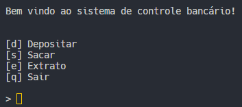

# Desafio de projeto 1

Primeiro projeto desenvolvido na trilha de backend com python, na plataforma DIO em colaboração com a Santander Open Academy

O programa é um simples aplicativo de controle bancário, em Python, feito em terminal.

---


### Instalação:
```bash
# Clone o repositório para o local
git clone https://github.com/LucasPeva/DIO-BackendPython-1.git
cd DIO-BackendPython-1
```

### Execução:
```bash
# Windows
python main.py

# Linux e MacOS
python3 main.py
```

## Tela principal
